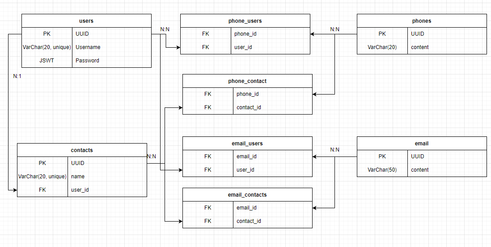

# @CONTACTS_TI

It's basicly the contacts app every phone has, developed as a full-stack tech interview. 
Developed using NodeJs(typescript) with express and typeORM in the backend, and React in the front-end.  

Unfortunatly, life got in the way and i couldn't spend as much time as i wanted to in this little project. I couldn't manage to write tests for either app, and there's cleaning up to do (refactoring) and missing features specially on the front-end. 

Not having a figma, or at least a reference img also made things slower. I have to admit, i'm not the most artiscally minded individual, i'm happier implementing others design vision than comming up with aesthetics myself. 

## Set up

The project has 2 folders, one for the server app, the other for the client app. 
To run you'll need to do the following: 

**Server** -
In the server folder inside this repo, open your prefered terminal. 
use the following commands: 

- npm install - to install dependencies. 
- create a .env file according to .env.example (I used a postgres database). 
- npm run dev - to run the server. 

**Client**-
In the client folder inside this repo, open your prefered terminal. 
use the following commands: 

- npm install - to install dependencies. 
- npm run start - to run the server. 

With both running in separate terminals you're set. 

## EDR

I had to think of how to structure the data in the most effective way possible, after some consideration i came up with the following: 

An user can register in the app, can have several phone and e-mails that belong to himself. 
Said user can create several contacts associated to the account, and those contacts can also have several phones/emails. 
 
To avoid redundancies related to several users having the same people as contacts, i decided to store the phone numbers and emails in their own separate tables, and creating Many-to-many relations to relate both the users individual contacts, and users themselves, with this phones/e-mails. 
 
The 4 tables in the middle are "pivot" tables, that only make the relations above eliminating the problem of unnecessary redundancies, that could overbloat the DB as the business scales (assuming it was a real app, not just a little project) 
 

## Other thoughts

I also thought if i should allow people to create diferent contacts with the same email/password.  At first it didn't make sense to me, but i checked on my phone and it does allow me to do so. I'm not imagining a scenario where it makes sense, but maybe i'm just missing something, and since i wasn't given any rules other than users and contacts can have several phones/emails, i decided to thrust my phone. 
 
It's a shame i couldn't devote more time before it ran out. It was a fun project, and it pains me to deliver an incomplete app. I couldn't implement User deletion and Contact edition on the front end sadly, and there's a lot to clean-up/refactor, and testing to write. 
Hopefully i can find the time to revisit this in the future. It's a super simple app but it has the potential to show many of the thing i learned, once it's complete .
